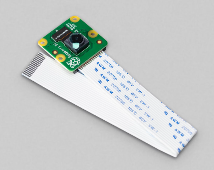

# Smart Fridge (AI)

## Overview
An AI-powered web application that detects expiry dates and categorizes fridge items automatically.

## Problem Statement
Households waste food due to poor inventory tracking.

## Solution
The system uses AI to recognize and track product's expiration dates, improving food management.

## Technologies Used
- AI / Computer Vision
- Web Application
- JavaScript / Python

## Key Features
- Date detection
- Expiry alerts
- Inventory dashboard

## Challenges
Accurate image recognition under different lighting conditions and dates writing styles.

## Results
Reduced food waste and improved inventory awareness.

## Future Improvements
- products type recognition and categorization. 
- Mobile app integration  
- Smart shopping suggestions

